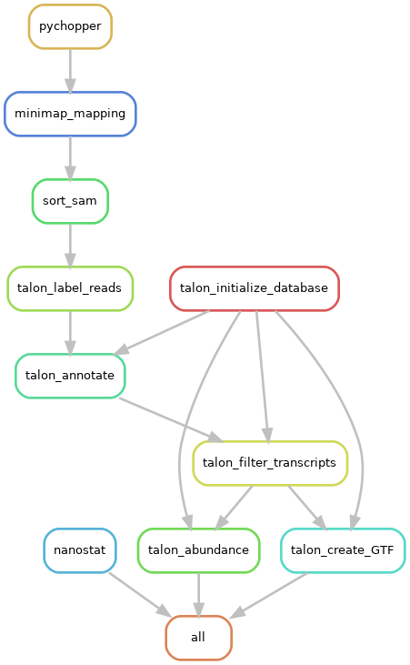

# ANNSeq - ANalysis of Nanopore SEQuencing

<!-- badges: start -->


[](https://github.com/sid-sethi/APTARS/blob/main/LICENSE)
<!-- badges: end -->

ANNSeq is a `snakemake` pipeline that takes Oxford Nanopore Sequencing (ONS) data (fastq) as input, generates fastq stats using `nanostat`, performs fastq processing and filtering using `pychopper`, map the reads to the genome using `minimap2` and uses `talon` to assemble and quantify transcripts. Below is the dag of the pipeline:  

<p align="center">
    
</p>


# Getting Started

## Input

- ONS fastq reads
- Reference genome assembly in fasta format
- GTF: [Gencode GTF](https://www.gencodegenes.org/human/); tested on v38 comprehensive CHR gene annotation

## Depedencies

- [miniconda](https://conda.io/miniconda.html)
- The rest of the dependencies (including snakemake) are installed via conda through the `environment.yml` file


## Installation

Clone the directory:

```bash
git clone --recursive https://github.com/sid-sethi/ANNSeq.git
```

Create conda environment for the pipeline which will install all the dependencies:

```bash
cd ANNSeq
conda env create -f environment.yml
```

## Usage

Edit `config.yml` to set up the working directory and input files/directories. `snakemake` command should be issued from within the pipeline directory. Please note that before you run any of the `snakemake` commands, make sure to first activate the conda environment using the command `conda activate annseq`.

```bash
cd ANNSeq
conda activate annseq
snakemake --use-conda -j <num_cores> all
```
It is a good idea to do a dry run (using -n parameter) to view what would be done by the pipeline before executing the pipeline.

```bash
snakemake --use-conda -n all
```

You can visualise the processes to be executed in a DAG:

```bash
snakemake --dag | dot -Tpng > dag.png
```

To exit a running `snakemake` pipeline, hit `ctrl+c` on the terminal. If the pipeline is running in the background, you can send a `TERM` signal which will stop the scheduling of new jobs and wait for all running jobs to be finished.

```bash
killall -TERM snakemake
```

To deactivate the conda environment:
```bash
conda deactivate
```

## Output
```
working directory  
|--- config.yml           # a copy of the parameters used in the pipeline  
|--- Nanostat/  
     |-- # output of nanostat - fastq stats  
|--- Pychopper/  
     |-- # output of pychopper - filtered fastq  
|--- Mapping/  
     |-- # output of minimap2 - aligned reads  
|--- Talon/  
     |-- # output of Talon  
     |-- _talon.gtf                       # assembled transcripts  
     |-- _talon_abundance_filtered.tsv    # transcript abundance  
     
```
